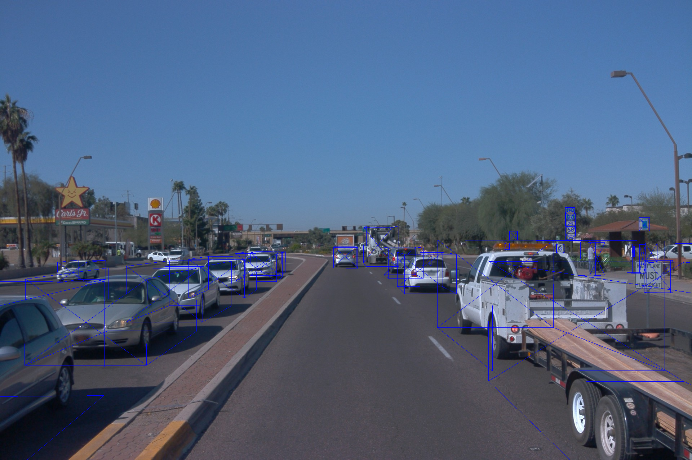
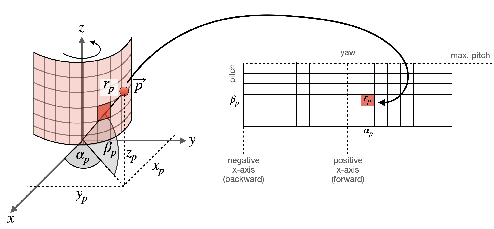

# Camera/Lidar Fusion with The Waymo Dataset

## Range Image structure

-- lasers ⇒ one branch for each entry in LaserName
        |-- name (LaserName)
        |-- ri_return1 (RangeImage class)
            |-- range_image_compressed
            |-- camera_projection_compressed
            |-- range_image_pose_compressed
            |-- range_image
        |-- ri_return2 (same as ri_return1)

## Front camera image with top laser 3D labels

## What are "Range Images"?
They are an alternative way to represent lidar scans.
This data structure holds 3d points as a 360 degree "photo" of the scanning environment with the row
dimension denoting the elevation angle of the laser beam and the column dimension denoting the azimuth angle.

## Lidar Resolution

- 64 lines and 2650 columns

Shape of the lidar range frame:
(64, 2650, 4)

64 in elevation/pitch
2650 in azimuth/yaw
Resolution in the azimuth:
360 / 2650 0.1358 degrees * (60 angular minutes/ degree) ~ 8 angular minutes

